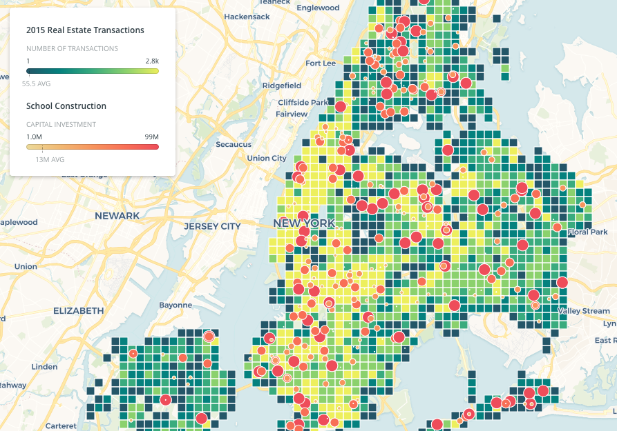

HW8 Readme

This is my readme for HW_8. 

I found data related to school construction in New York City, found here: https://data.cityofnewyork.us/Housing-Development/Projects-in-Construction-Map/dzgh-ja44#column-menu

Using a python notebook, I filtered the data to show only projects with a cost exceeding $1,000,000. The notebook is in this directory and called HW8_1.ipnyb

Next, I brought this information into Carto and expressed it as circles with size and color relative to project cost. However, this data felt unmoored and needed to be shown with some context. For this, I brought in a 2015 data set showing the number or real estate transactions. This was interesting to highlight where investments in school facilities were in relation to new real estate sales. 

The map can be found here: https://dhi211.carto.com/builder/1e7786d9-926f-4dd9-9a3e-3297a9a8d18d/embed

