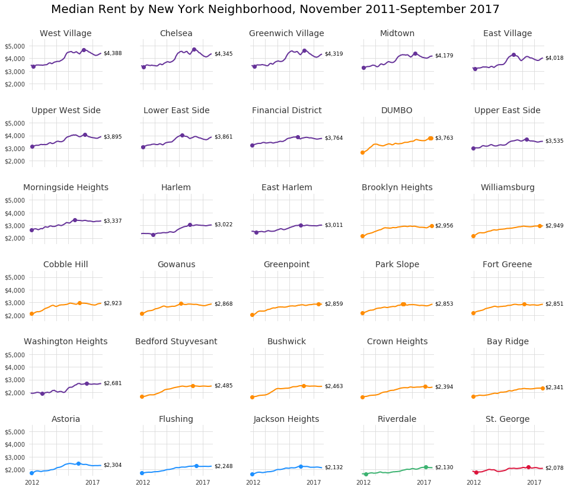

# HW8_sgo230_Review
https://github.com/sgo230/PUI2017_sgo230/tree/master/HW8_sgo230

Caption from sgo230: 

"Figure 1: Median rent for November 2011 - September 2017 for 30 select New York City neighborhoods across the five boroughs. Dots on lines represent the maximum and minimum rent for the period covered. Labels beside points show the latest median rent.
Source: Zillow (https://www.zillow.com/research/data/#rental-data)."

### CLARITY: is the plot easy to read? is it clear or confusing, are the quantities being visualized ambiguous?
- This plot is very easy to read. Clearly shows history of median rent prices.
- Without a legend, identifying what each color corresponds to took some time to figure out, the same goes for the dots on each plot. The description below the plot clarifies the latter.

[Recommendations]
- I would consider listing the November 2011 median rent figure on the left side of each chart as the September 2017 data is displayed. This would allow the user to see in real numbers the change in median rent. 
- Add a legend.

### ESTHETIC: beautiful is a subjective judgment: you should not judge the plot on the basis of whether you think it is "beautiful", but you should judge whether its esthetic is functional to what it is meant to communicate. Are the colors chosen appropriately? Are the graphical elements used appropriate to represent the quantities being visualized? Are the graphical choices allowing you to focus on the right elements or are they distracting you?
- I think the colors, background grids, and size of points are perfectly sized with appropriately proportioned labels. 

[Recommendation]
- Depending on the story you’re trying to tell, it would be good to rethink one of the following: order of graphs (show by Borough, by greatest increase, by highest rent increase, etc.).
- Similarly, the difference in rent could be highlighted in some way. Possibly using the size of the lines or relative sizes of the points.

HONESTY: is the plot honestly reproducing the data or is it deforming it, perhaps to emphasize a point?
- I think this plot does a good job of honestly showing the data.
- An explanation about how you arrived at these neighborhoods, rather than other neighborhoods, would be helpful in limit speculation about why certain places were preferred over others.

[Recommendation]
- Find what the narrative is from this data. Depending on the point you want to make, you may want to thin out how much data is conveyed in order to attract the viewer’s eye to one a specific piece of information.
